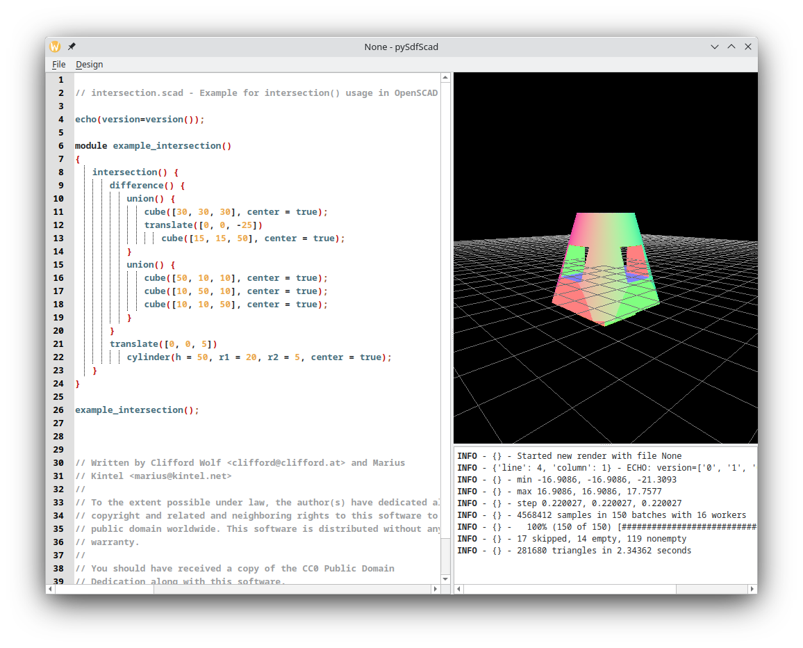

**ALPHA SOFTWARE, NOT READY FOR USE**

This is currently made available for developers, don't expect this to be
usable for a while. Core language primitives work for the most part, but
things are missing and the stuff that does work doesn't work exactly like it
does in openscad.

An openscad interpretor (compiler?) written in python and using signed-distance functions.

Compiles openscad code to a python abstract-syntax-tree (which can then be converted into
python text or run on as-is)

We use [fogleman's SDF library](https://github.com/fogleman/sdf) which makes exentsive use
of numpy.

# Instalation

# Faq

## Differences from openscad

While we aim to be fully compatible with openscad there are some difference. If
you don't see that difference mentioned here, well that's probably a bug
that needs fixing.

Right now we are **NOT FEATURE COMPLETE WITH OPENSCAD**. A number of openscad
feature remain unimplemented.

 * OpenScad meshes will be simpler and have smaller filesizes

PySdfScad constructes meshes by sampling a signed distance field, this essentially means that
the entire object has the same amount of triangles for a given surface area, whether that surface
is a large flat plain or a complicated curve.

This is something that can be improved upon in the future (look into collinear mesh simplification), 
but it's likely PySdfScad meshes will always be a bit "messier".

 * You can assign geometry objects to variables, and write functions that modify geometry.

For example constructs like  `"foo=sphere(r=2);` will work. This is because signed distance function
based geometry is... based on functions. This is a somewhat advanced feature that you
probably don't need to worry about, but if you ever wished you could store an object in an array, well
now you can.

 * There are a lot more options for modifying a mesh

This is really the reason this project exists, our [underlying library](https://github.com/fogleman/sdf#miscellaneous)
 supports a number of more complicated ways of modifying geometry. and we expose
that as new openscad operators. For example you can use the `shell(thickness=0.2){...}`
operator to make objects hollow (amazing for things like pipes), or use
`smooth_union` to join two objects with a smooth fillet.

 * You can't color a mesh, or make parts of it transparent

This is another thing that can probably be fixed eventually, but is still quite challenging.

## Development

 * Wouldn't an interpreter be better than a compiler?

Probably, yeah. The openscad to AST got a bit out of hand. Now that it does exist though
there are some pretty significant advantages. We can do proper tracebacks and other cool
exception handling. We can also, furthur down the line, do things like import/introspect/modify
an openscad file from another language (like python, or a theoretical future openscad-ish
language).

More complicated than it probably needed to be, but I'm hopeful I can do some cool
stuff with it in the future. The original (unfinished) interpreter code was also a handful,
and I don't think this is all that much more unreadable.

## It's still alpha software

I don't want to give a false impression that it works from this carefully staged screenshot,
it mostly doesn't.

